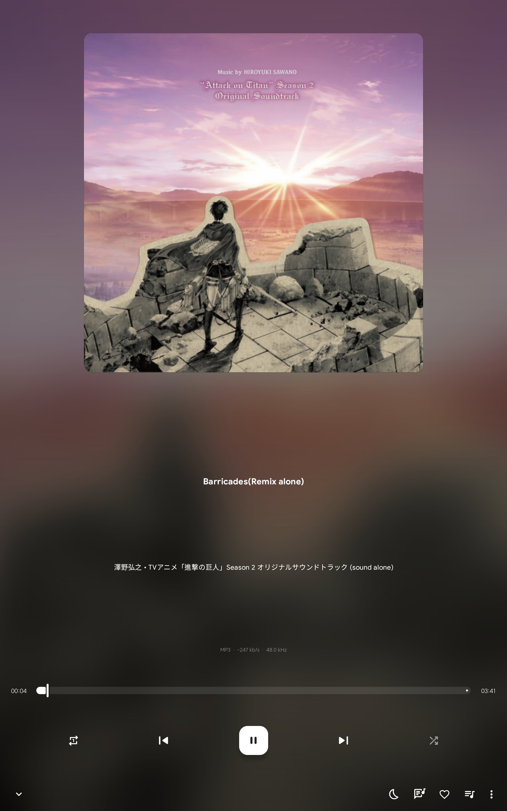
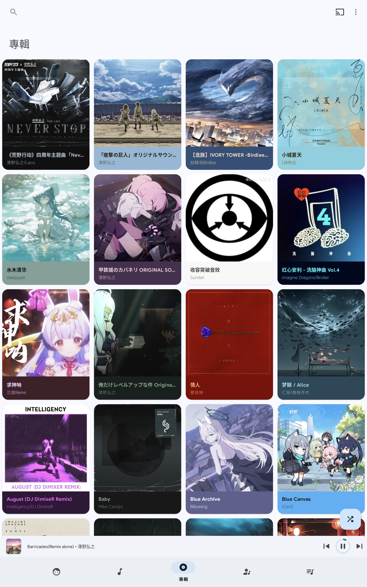

# 🎵 LifeMusic - Android 音乐播放器
# fork from RetroMusic
 url - https://github.com/RetroMusicPlayer/RetroMusicPlayer/
一款简洁美观的 Android 音乐播放应用，让你のlife充满旋律。

## 📱 应用介绍

**LifeMusic** 是为 Android 平台开发的本地音乐播放器，主打简洁 UI 与流畅体验。无广告、无打扰，只为让你专注于音乐本身。

---

## ✨ 核心功能

- 🎧 本地音乐扫描与播放
- 📁 歌单管理（创建 / 编辑 / 删除）
- 🔁 支持顺序播放、单曲循环、随机播放
- 🎼 显示音乐信息（标题、专辑、艺术家）
- 🌙 深色 / 浅色主题切换
- 🔊 支持后台播放与通知栏控制
- 拥有 musicfx / equalizer（第三方）
- support lyrics font size

#未来工作
- 🎚️ 可视化音频频谱（👆😈）
- 修复 musicfx问题 和 改进 musicfx
- 完全移除 google cast 和 google 内购服务
- 修复 material 主题错误
- 优化 歌词字体大小设置
- 優化theme 切換 或 其他卡の頓問題
---

## 📸 界面预览

| 首页 | 播放界面 | 歌单界面 |
|------|----------|----------|
|  |  |  |

---
# 软件の界面嚴格遵循 material you
